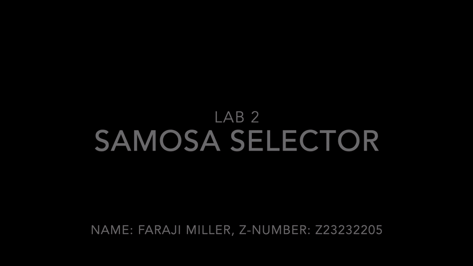

# lab-2-fmiller2012

Name: Faraji Miller, Z-Number: Z23232205

Required Features
- [x] Download and install Node.js
- [x] A large samosa that the user can click to harvest one samosa at a time
- [x] A counter displaying the number of samosas the user currently has
- [x] Three upgrades that increase the effectiveness of the user’s cursor at certain point thresholds

Stretch Features
- [x] When purchasing an upgrade, the user loses samosas from their total count
- [x] Decrease the scale of the large samosa when the user clicks the samosa to create a pulse effect

Goals
- [x] Use useState hook to create a state variable and a function that is used to update the state
- [x] Register an onClick event to a button in a React project
- [x] Define event handling functions in a React project

Paragraph Describing What I Have Done And Learned:

